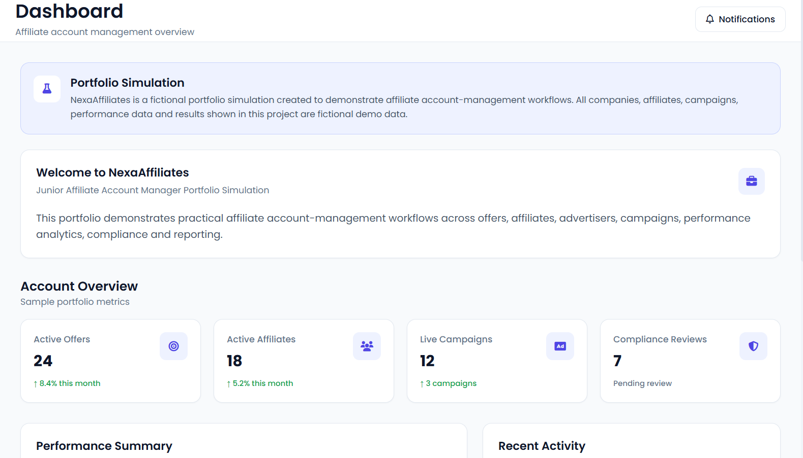
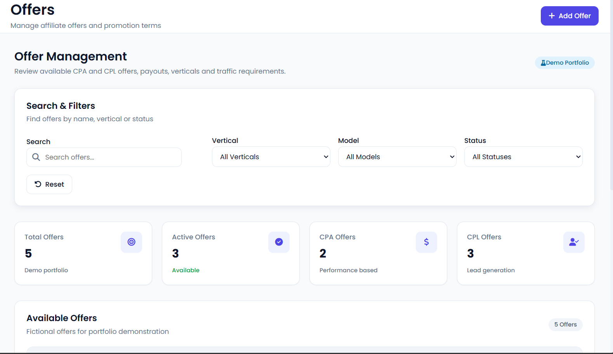
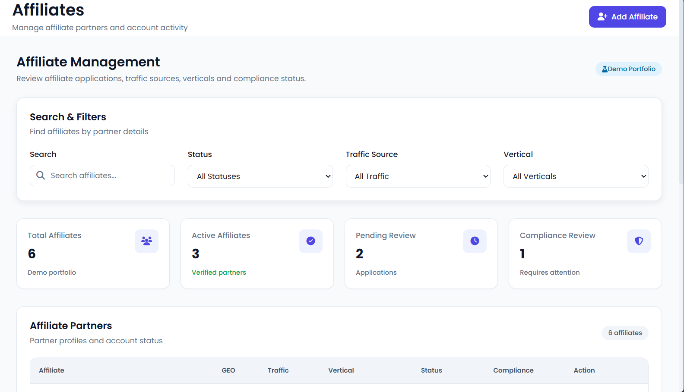
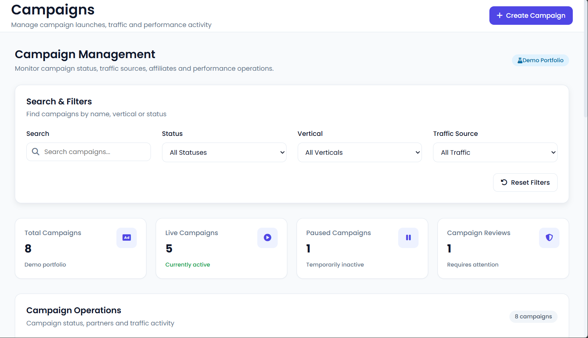
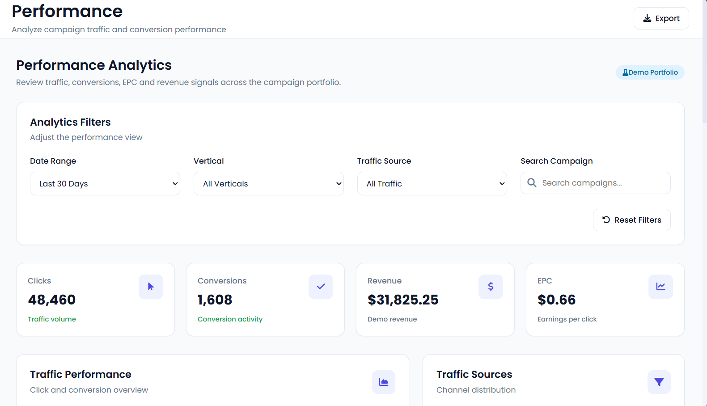

# NexaAffiliates — Affiliate Account Manager Portfolio Simulation

> A fictional front-end portfolio simulation demonstrating affiliate account management, offer management, campaign operations, performance analytics, compliance workflows, communications, and reporting.

## 🌐 Live Demo

**GitHub Pages:**  
https://krishnasahu012.github.io/NexaAffiliates/

---

## 📌 Project Overview

NexaAffiliates is a portfolio simulation designed to demonstrate practical workflows commonly associated with an Affiliate Account Manager / Junior Affiliate Manager role.

The project represents a fictional US-market performance marketing environment focused on:

- CPA Marketing
- CPL Marketing
- Affiliate Management
- Offer Management
- Advertiser Coordination
- Campaign Management
- Performance Monitoring
- Compliance Review
- Affiliate Communications
- Reporting and Analytics

**Important:** All companies, affiliates, advertisers, campaigns, performance figures, revenue values, and results in this project are fictional demo data created for portfolio purposes.

---

## 🎯 Project Objectives

The main objectives of NexaAffiliates are to demonstrate the ability to:

- Organize affiliate accounts
- Manage performance marketing offers
- Track affiliate and advertiser relationships
- Monitor campaign status
- Analyze clicks and conversions
- Calculate conversion rates and EPC
- Monitor traffic sources
- Track compliance reviews
- Manage account communications
- Generate operational reports
- Present performance information through a professional dashboard

---

## 🖥️ Main Modules

### Dashboard

Provides a centralized overview of the fictional affiliate operation.

### Offers

Demonstrates offer management including offer ID, vertical, conversion model, payout, traffic source, and status.

### Affiliates

Demonstrates affiliate account management, traffic sources, vertical focus, account status, and performance tracking.

### Advertisers

Demonstrates advertiser account organization and campaign relationships.

### Campaigns

Tracks fictional campaign operations including advertiser, affiliate, vertical, traffic source, and campaign status.

### Analytics

Provides fictional performance data including clicks, conversions, revenue, conversion rate, EPC, and traffic sources.

### Compliance

Demonstrates risk levels, review checks, passed checks, review status, and review dates.

### Communications

Demonstrates account communication tracking between affiliates, advertisers, and internal teams.

### Reports

Provides fictional operational reports covering performance, accounts, campaigns, and compliance.

### Case Study

Provides a fictional campaign case study showing how performance data can be organized and interpreted.

### Documentation

Contains project documentation covering the system structure, workflows, methodology, testing, and deployment.

---

## 🧮 Analytics Methodology

### Conversion Rate

Conversion Rate = Conversions ÷ Clicks × 100

### EPC

EPC = Revenue ÷ Clicks

### Fictional Example

Clicks: 8,420

Conversions: 286

Revenue: $5,148.00

The displayed metrics are fictional demo values created specifically for this portfolio simulation.

---

## 🛠️ Technology Stack

| Technology | Purpose |
|---|---|
| HTML5 | Page structure |
| CSS3 | Styling and responsive layout |
| Vanilla JavaScript | Interactions and data rendering |
| Font Awesome | Interface icons |
| Google Fonts | Typography |
| GitHub Pages | Static website hosting |

---

## 📊 Portfolio Skills Demonstrated

- Affiliate Account Management
- Performance Marketing
- CPA / CPL Campaigns
- Offer Management
- Affiliate Relationship Management
- Advertiser Coordination
- Campaign Monitoring
- Performance Analysis
- Conversion Rate Analysis
- EPC Analysis
- Traffic Source Monitoring
- Compliance Tracking
- Reporting
- Data Organization
- Front-End Development
- Responsive UI Design
- GitHub Pages Deployment

---

## 🔍 Testing

The project includes testing of:

- Dashboard navigation
- Offer management
- Affiliate interface
- Advertiser interface
- Campaign interface
- Analytics interface
- Compliance interface
- Communications interface
- Reports
- Case Study
- Documentation
- Responsive layouts
- GitHub Pages deployment
- Relative asset paths

---

## 🚀 Deployment

The project is deployed as a static website using GitHub Pages.

**Branch:** main

**Directory:** / (root)

**Live URL:**  
https://krishnasahu012.github.io/NexaAffiliates/

---

## 📚 Documentation

Detailed documentation is available inside the `docs/` directory.

Documentation includes:

- Project Overview
- Architecture
- Affiliate Management
- Offer Management
- Campaign Management
- Compliance Workflow
- Analytics Methodology
- Testing
- Deployment

---

## 📸 Project Screenshots

### Dashboard

### Offers

### Affiliates

### Campaigns

### Analytics

---

## ⚠️ Portfolio Disclaimer

NexaAffiliates is a fictional portfolio simulation.

It does not represent:

- Real employment experience
- Real affiliate network operations
- Real advertisers
- Real affiliates
- Real client accounts
- Real campaign results
- Real revenue

All organizations, names, campaigns, metrics, and performance information are fictional and created for demonstration purposes.

---

## 👤 Portfolio Project

**Project:** NexaAffiliates

**Category:** Affiliate Account Manager Portfolio Simulation

**Market:** US

**Focus:** CPA / CPL / Performance Marketing

**Platform:** GitHub Pages

---

## ⭐ Project Highlights

- Professional affiliate management dashboard
- Modular front-end architecture
- Responsive design
- Fictional performance marketing dataset
- Campaign analytics
- Compliance workflow
- Communication tracking
- Reporting module
- Documentation system
- GitHub Pages deployment
